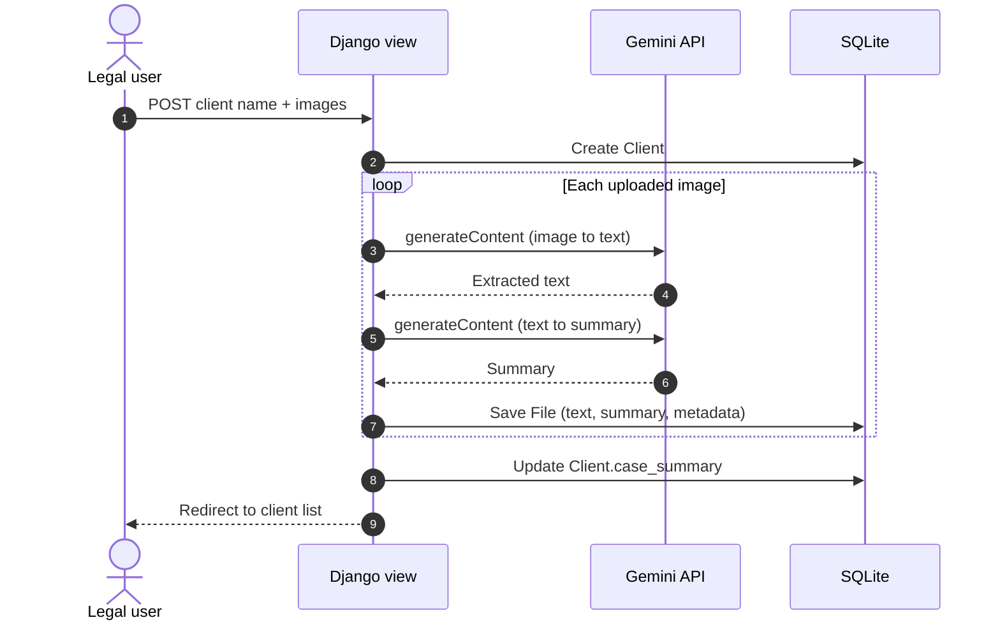

# Lexi Legal — AI Legal Assistant


Lexi Legal is a Django web application that ingests images of case documents, sends them to Google's Gemini multimodal API to extract printed and handwritten text, and generates a concise legal summary for each file. Results are stored per client in a user-scoped workspace. Paper-based case material becomes reviewable, searchable text without manual transcription.

**Contents:** [Key Features](#key-features) · [Tech Stack](#tech-stack) · [Architecture](#architecture) · [Getting Started](#getting-started) · [Usage Guide](#usage-guide) · [Configuration](#configuration--environment-variables) · [Security & Privacy](#security--privacy) · [Roadmap](#roadmap) · [Contributing](#contributing) · [License](#license) · [Author](#author)

---

## Key Features

- **Multimodal OCR:** Each uploaded image is sent to the Gemini `generateContent` endpoint as base64 `inlineData`. The prompt requests all text, including handwriting, and uses a low temperature (`0.1`) to favor transcription fidelity.
- **Legal-focused summarization:** A second Gemini call summarizes the extracted text, emphasizing key points, entities, dates, and legal implications. Non-legal text falls back to a general summary.
- **Client-centric case files:** Documents are grouped under client profiles. A client's `case_summary` aggregates its per-document summaries, joined with ` | ` and truncated to 1,000 characters.
- **Batch upload with preview:** Submit multiple images at once. The upload form supports drag-and-drop, file previews, per-file removal, client-side validation, and a processing indicator.
- **Per-file fault isolation:** An unsupported type, empty file, or API error on one image is reported to the user without aborting the rest of the batch.
- **Per-user data isolation:** Every query is scoped to the authenticated user (`Client.user`, `File.client__user`), so users cannot read or delete each other's clients or documents.
- **Session-based authentication:** Registration, login, and logout use Django's built-in forms and session middleware. Django admin at `/admin/` handles user management.
- **JSON processing endpoint:** `POST /api/process_file/` supports scripted or AJAX ingestion of a single file.
- **Minimal operational footprint:** SQLite, no task queue, and no JavaScript build toolchain. The app runs with `manage.py runserver`.
- **No file retention:** The application does not persist original image files. Only extracted text, the summary, filename, MIME type, and size are stored.

## Tech Stack

| Layer | Technology |
| --- | --- |
| Language | Python 3.13 |
| Web framework | Django 5.2 (ORM, auth, sessions, templates, admin) |
| Database | SQLite 3 (Django default) |
| AI / OCR | Google Gemini API, REST `v1beta/models/{model}:generateContent` |
| HTTP client | `requests` |
| Imaging | `Pillow` (imported by the views; not yet used) |
| Frontend | Django templates, vanilla JavaScript, custom CSS (`static/styles.css`) |
| UI assets | Font Awesome 6.4 and Inter, loaded from CDNs |

## Architecture



### Data model

| Model | Field | Type | Notes |
| --- | --- | --- | --- |
| `Client` | `user` | FK → `auth.User` | Owner; cascade delete |
| | `full_name` | `CharField(200)` | |
| | `case_summary` | `TextField`, nullable | Aggregate of document summaries |
| | `created_at` | `DateTimeField` | Auto-set |
| `File` | `client` | FK → `Client` | Cascade delete |
| | `name` | `CharField(255)` | Original filename |
| | `extracted_text` | `TextField`, nullable | Gemini OCR output |
| | `content` | `TextField` | Gemini-generated summary |
| | `file_type` | `CharField(100)` | MIME type |
| | `file_size` | `IntegerField` | Bytes |
| | `processed` | `BooleanField` | |
| | `uploaded_at` | `DateTimeField` | Auto-set |

### Routes

| Path | Auth | Purpose |
| --- | --- | --- |
| `/` | Public | Sign in |
| `/register/` | Public | Create an account |
| `/dashboard/` | Required | Landing page |
| `/clients/add/` | Required | Create a client and upload documents |
| `/clients/` | Required | List clients and case summaries |
| `/files/` | Required | List all documents across clients |
| `/clients/<id>/` | Required | Client detail (template pending; see [Roadmap](#roadmap)) |
| `/clients/<id>/delete/` | Required | Delete a client (`POST`) |
| `/api/process_file/` | Required | Process one image (`POST`) |
| `/logout/` | Required | End the session |
| `/admin/` | Staff | Django admin |

### Project structure

```text
.
├── lexi_legal/
│   ├── manage.py
│   ├── .env.example
│   ├── assistant/
│   │   ├── migrations/
│   │   ├── admin.py
│   │   ├── apps.py
│   │   ├── models.py        # Client, File
│   │   ├── tests.py
│   │   ├── urls.py          # App route table
│   │   └── views.py         # Auth, client/file views, Gemini calls, JSON API
│   ├── lexi_legal/
│   │   ├── asgi.py
│   │   ├── settings.py
│   │   ├── urls.py
│   │   └── wsgi.py
│   ├── static/
│   │   └── styles.css
│   └── templates/
│       ├── base.html
│       ├── login.html
│       ├── register.html
│       ├── dashboard.html
│       ├── new_client.html
│       ├── existing_clients.html
│       └── all_files.html
├── .gitignore
├── LICENSE
├── README.md
└── requirements.txt
```

## Getting Started

### Prerequisites

- Python 3.13 (Django 5.2 supports Python 3.10–3.13)
- Git
- A Gemini API key from [Google AI Studio](https://aistudio.google.com/apikey)

### Installation

```bash
# 1. Clone the repository
git clone https://github.com/<your-username>/AI-Legal-Assistant.git
cd AI-Legal-Assistant

# 2. Create and activate a virtual environment
python -m venv .venv
source .venv/bin/activate          # Windows (PowerShell): .venv\Scripts\Activate.ps1

# 3. Install dependencies
pip install -r requirements.txt

# 4. Move into the Django project
cd lexi_legal
```

### Configure the environment

Copy the example file and set your values. See [Configuration](#configuration--environment-variables) for every variable.

```bash
cp .env.example .env               # Windows (PowerShell): Copy-Item .env.example .env
```

Generate a Django secret key and paste it into `DJANGO_SECRET_KEY`:

```bash
python -c "from django.core.management.utils import get_random_secret_key; print(get_random_secret_key())"
```

> [!IMPORTANT]
> Set `DJANGO_DEBUG=True` for local development. With `DEBUG` off, `runserver` does not serve static files and the UI renders unstyled.

### Initialize the database and run

```bash
python manage.py migrate
python manage.py createsuperuser   # optional; grants access to /admin/
python manage.py runserver
```

Open <http://127.0.0.1:8000/>, register an account, and you land on the dashboard.

> [!NOTE]
> `runserver` is a development server. The project ships without production settings (`STATIC_ROOT`, HTTPS and cookie hardening). Run `python manage.py check --deploy` and address its findings before exposing the app publicly.

## Usage Guide

### Web interface

1. **Register or sign in** at `/`.
2. From the dashboard, choose **Add New Client**.
3. Enter the client's full name and select or drag in one or more images (JPG, PNG, GIF, WebP).
4. Choose **Process & Create Client**. Each image is OCR'd and summarized, then saved.
5. Open **Manage Clients** to review each client's aggregate case summary, or **All Documents** to browse every processed file.

### JSON API

`POST /api/process_file/` accepts `multipart/form-data` with an authenticated session cookie.

| Field | Type | Description |
| --- | --- | --- |
| `client_id` | integer | ID of a client owned by the authenticated user |
| `file` | file | One image (`image/*`) |

Client IDs are not yet shown in the UI. List them from the shell:

```bash
python manage.py shell -c "from assistant.models import Client; print(list(Client.objects.values('id', 'full_name')))"
```

**cURL**

```bash
BASE=http://127.0.0.1:8000

# Obtain a CSRF cookie, then sign in and store the session
curl -sS -c cookies.txt "$BASE/" -o /dev/null
CSRF=$(awk '$6=="csrftoken"{print $7}' cookies.txt)
curl -sS -b cookies.txt -c cookies.txt -e "$BASE/" "$BASE/" -o /dev/null \
  -d "username=$LEXI_USER" -d "password=$LEXI_PASS" -d "csrfmiddlewaretoken=$CSRF"

# Upload a document to client 1
curl -sS -b cookies.txt "$BASE/api/process_file/" \
  -F "client_id=1" \
  -F "file=@./scan.jpg;type=image/jpeg"
```

**Python**

```python
import os
import requests

BASE_URL = "http://127.0.0.1:8000"

with requests.Session() as session:
    session.get(f"{BASE_URL}/")  # sets the csrftoken cookie
    session.post(
        f"{BASE_URL}/",
        data={
            "username": os.environ["LEXI_USER"],
            "password": os.environ["LEXI_PASS"],
            "csrfmiddlewaretoken": session.cookies["csrftoken"],
        },
        headers={"Referer": f"{BASE_URL}/"},
    ).raise_for_status()
    assert "sessionid" in session.cookies, "Login failed"

    with open("scan.jpg", "rb") as fh:
        response = session.post(
            f"{BASE_URL}/api/process_file/",
            data={"client_id": 1},
            files={"file": ("scan.jpg", fh, "image/jpeg")},
            timeout=120,
        )
    response.raise_for_status()
    print(response.json()["summary"])
```

**Response** (illustrative)

```json
{
  "success": true,
  "file_id": 12,
  "extracted_text": "…text transcribed from the image…",
  "summary": "…concise legal summary…"
}
```

| Status | Meaning |
| --- | --- |
| `200` | File processed and saved |
| `400` | No file, non-image file, or empty file |
| `405` | Method other than `POST` |
| `500` | Gemini request failed, or `client_id` does not match a client you own |

### Inspect stored results

```bash
python manage.py shell -c "from assistant.models import File; f = File.objects.latest('uploaded_at'); print(f.name); print(f.extracted_text); print(f.content)"
```

## Configuration & Environment Variables

Variables are read from the process environment. On startup, `python-dotenv` also loads `lexi_legal/.env` (variables already set in the environment take precedence).

| Variable | Type | Required | Default | Description |
| --- | --- | --- | --- | --- |
| `GEMINI_API_KEY` | string | Yes | — | Gemini API key. AI calls raise `ValueError("API key not configured.")` if empty. |
| `GEMINI_MODEL` | string | No | `gemini-3.5-flash` | Gemini model ID used for OCR and summarization. Must support image input. |
| `DJANGO_SECRET_KEY` | string | Yes | — | Django cryptographic signing key. Startup fails if unset. |
| `DJANGO_DEBUG` | boolean | No | `False` | Accepts `1`, `true`, or `yes` (case-insensitive). Never enable in production. |
| `DJANGO_ALLOWED_HOSTS` | comma-separated list | No | `127.0.0.1,localhost` | Hostnames Django will serve. |

Example `.env`:

```dotenv
DJANGO_SECRET_KEY=replace-with-generated-key
DJANGO_DEBUG=True
DJANGO_ALLOWED_HOSTS=127.0.0.1,localhost
GEMINI_API_KEY=
GEMINI_MODEL=gemini-3.5-flash
```

> [!WARNING]
> Google retires Gemini model IDs on a published schedule. If AI calls return `404`, choose a current model from the [Gemini models list](https://ai.google.dev/gemini-api/docs/models) and check the [deprecation schedule](https://ai.google.dev/gemini-api/docs/deprecations).

## Security & Privacy

> [!IMPORTANT]
> Uploaded documents are transmitted to Google's Gemini API for processing. Review Google's data-use terms for your API tier, and confirm the setup satisfies your confidentiality, privilege, and regulatory obligations before processing client material.

> [!IMPORTANT]
> Model output can be incomplete or wrong. Transcriptions and summaries are aids to review, not legal advice or a substitute for reading the source documents.

Current hardening gaps you should account for before any real deployment:

- **Password rules:** `AUTH_PASSWORD_VALIDATORS` is empty, so weak passwords are accepted.
- **CSRF:** `/api/process_file/` is `@csrf_exempt` and relies on session authentication alone.
- **Logging:** The Gemini helper prints request and response details to stdout. Replace these with structured logging that excludes document content and credentials.
- **Secrets:** Never commit `.env`, API keys, or `db.sqlite3`.

## Roadmap

Contributions on any of these are welcome.

- [ ] Client detail page (route exists; `client_detail.html` is missing)
- [ ] Delete-confirmation page (route exists; `confirm_delete.html` is missing)
- [ ] Wire the **View Files**, **Add File**, and **Delete** buttons on the Clients page (currently `href="#"`)
- [ ] Route `file_detail_view` (defined, not yet in `urls.py`)
- [ ] Render dashboard statistics (computed in the view, not displayed)
- [ ] PDF and DOCX ingestion (images only today)
- [ ] Optional storage of original uploads
- [ ] Register `Client` and `File` in Django admin
- [ ] Return `404` for an unknown `client_id` on the API (currently `500`)
- [ ] Replace `print` calls with `logging`; restore CSRF protection or add token authentication on the API
- [ ] Enable password validators and add production settings
- [ ] Automated tests, CI, and a container image

> [!NOTE]
> OCR output is capped at 2,048 tokens per image and summaries at 1,024 tokens (`maxOutputTokens` in `views.py`). Very dense pages may be truncated.

## Contributing

1. **Open an issue** describing the bug or feature before starting significant work.
2. **Fork** the repository and create a branch from `main`:

```bash
   git checkout -b feature/short-description
```

3. **Make focused changes** that follow PEP 8. Add tests for new behavior. The test module is currently empty, so new coverage is especially valuable.
4. **Verify locally** before opening a pull request:

```bash
   python manage.py check
   python manage.py makemigrations --check --dry-run
   python manage.py test
```

5. **Commit** using [Conventional Commits](https://www.conventionalcommits.org/) (`feat:`, `fix:`, `docs:`, `refactor:`, `test:`).
6. **Open a pull request** against `main` with a description of the change, how you tested it, and any migration or configuration impact.

Do not include secrets, uploaded documents, databases, or virtual environments in commits.

## License

Distributed under the MIT License. See [`LICENSE`](LICENSE) for details.

Copyright (c) Tamjid.

## Acknowledgements

[Django](https://www.djangoproject.com/), the [Google Gemini API](https://ai.google.dev/), [Font Awesome](https://fontawesome.com/), and [Inter](https://rsms.me/inter/).

## Author

**Tamjid**
